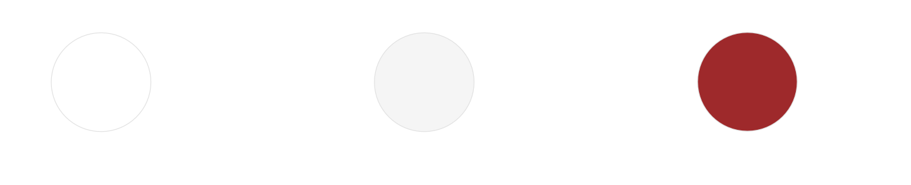
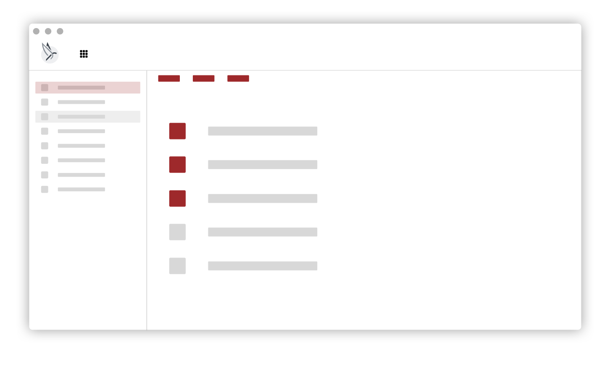
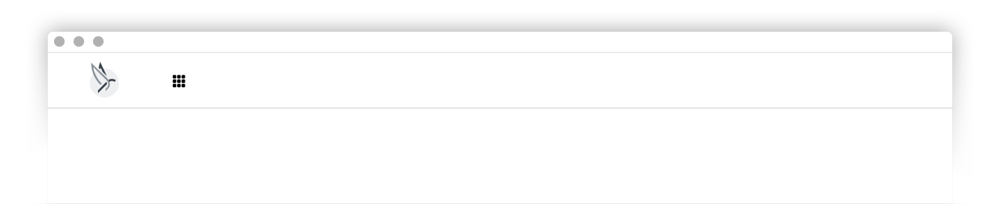
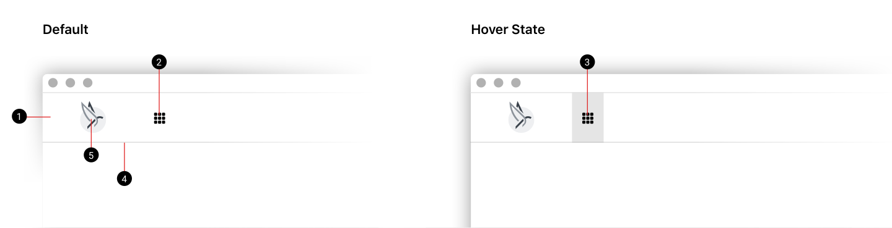
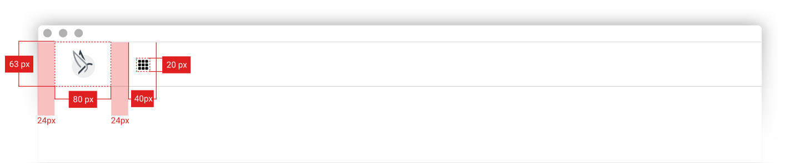
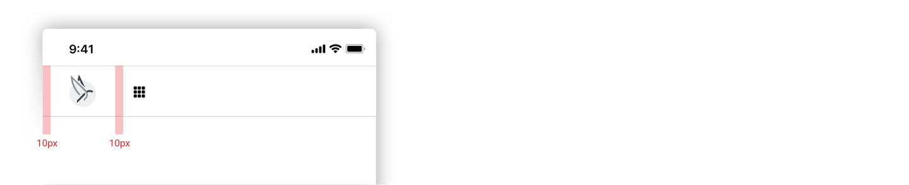
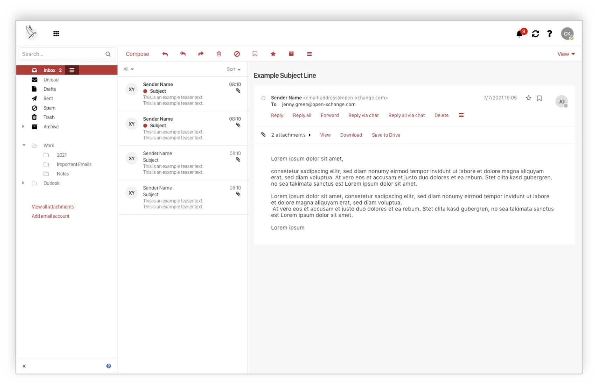
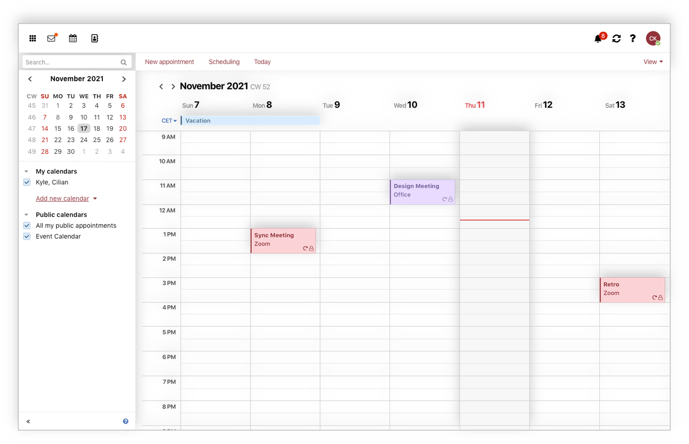
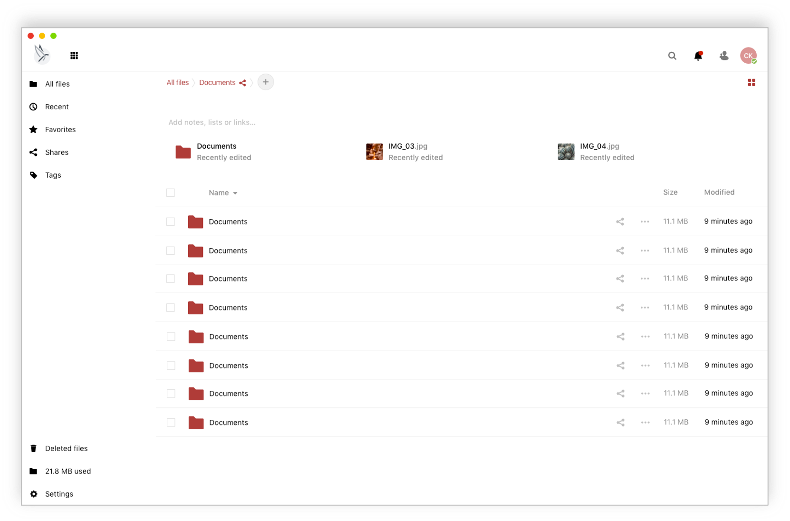

# Look and Feel

|                                   |                                                     |
| --------------------------------- | --------------------------------------------------- |
| Story for original implementation | [PBSR-322](https://jira.open-xchange.com/browse/PBSR-322)
| Code repository                   | <https://gitlab.open-xchange.com/extensions/public-sector>
| Package(s)                        | `open-xchange-appsuite-public-sector`
| Required capabilities             | `com.openexchange.capability.dynamic-theme`
| Available since                   | 7.10.6
| Maintainers                       | Viktor Pracht

## Introduction and Goal

The goal is to integrate multiple open source products in such a way with each other, so that the users of the public administration can use them in an even more efficient and intelligent way for the completion of their daily tasks.

To achieve this, the web interfaces of the Phoenix components will be visually standardized. The products must be integrated via open interfaces in such a way that the daily work processes of the users can be accomplished intuitively across applications without interruption.

The standardization will be summarized in a kind of style guide and then implemented in a first step by OX App Suite and Nextcloud as an example.

The focus of the standardization is on the common color scheme as well as a uniform design of the top bar including app navigation (see Central Navigation). All changes to the look & feel should be as easy as possible to be implemented using web technologies (CSS, Dynamic Theming, etc.) so that other applications can also benefit from them.

Out of scope:

Changes that would interfere with program logic or content, such as a unified help system or help texts, are not considered.

## Style Guide definition

### Color Scheme

A common color scheme is the basis for achieving a uniform look and feel. For this purpose, all apps are given a uniform color scheme to convey the consistency of the products to the user. The theme consists mainly of white and light gray tones. This directs the focus to content areas.



#### Interactive Color

The interactive color is used for all interactive elements and the highlighting of active or selected elements. These are quickly recognized and well perceived.



### Top Bar

#### Overview

The top bar is combined into a constant layout on all platforms and consists of the product logo and the entry point for global navigation on the left side. The right side of the top bar is reserved for app specific actions.



## Specifications



| Element             | Attribute         | Value     |
|---------------------|-------------------|-----------|
| Top Bar background  | Background color  | `#ffffff` |
| Launcher entry      | Icon color        | `#1f1f1f` |
|                     | Background color  | none      |
| Launcher entry hover state | Icon color | `#1f1f1f` |
|                     | Background color  | `rgba(0, 0, 0, 0.1)` |
| Top Bar bottom line | Height            | `1px`     |
|                     | Color             | `#dddddd` |
| Top Bar logo        | Image             | Please see below |


### Measurements

#### Default



#### Mobile



### App Content

| Element        | Attribute        | Value     |
|----------------|------------------|-----------|
| Main color     | Color            | `#9e292b` |
| Link color     | Color            | `#9e292b` |
| Buttons        | Background color | `#9e292b` |
| App background | Background color | `#ffffff` |
| Side bar       | Background color | `#ffffff` |
| List items     | Hover color      | `#dddddd` |
|                | Select color     | `#e1bebf` |
|                | Active color     | `#9e292b` |

## Screenshots

### OX App Suite - Mail



### OX App Suite - Calendar



### Nextcloud - Files



## OX Implementation

The theme is implemented as a dynamic theme using the following configuration file:

```properties
# The main highlight color. Setting only this variable might already be enough.
# A dark color, default: #283f73
io.ox/dynamic-theme//mainColor=#9e292b

# Text color for links and border-less buttons.
# A dark color, default: @io-ox-dynamic-theme-mainColor
io.ox/dynamic-theme//linkColor=@io-ox-dynamic-theme-mainColor

# Background color of the login screen.
# A dark color, default: #1f3d66
io.ox/dynamic-theme//loginColor=#1f3d66

# Text color of the "OX" prefix on the login screen.
# A light color, default: #6cbafc
io.ox/dynamic-theme//headerPrefixColor=#6cbafc

# Text color of the "App Suite" product name on the login screen.
# A light color, default: #fff
io.ox/dynamic-theme//headerColor=#fff

# URL of an image which replaces the "OX App Suite" header text on
# the login screen.
io.ox/dynamic-theme//headerLogo=

# URL of the logo in the top left corner of the top bar.
io.ox/dynamic-theme//logoURL=/appsuite/apps/themes/phoenix/logo.svg

# Width of the logo as number of pixels or any CSS length unit.
# For best display on high-resolution screens, it is recommended to use
# a bigger image and specify a smaller size here.
# Set to "auto" to use the native width of the image.
# Default: 60
io.ox/dynamic-theme//logoWidth=80

# Optional height of the logo as number of pixels or any CSS length unit.
# The maximum value is 64. For best display on high-resolution screens,
# it is recommended to use a bigger image and specify a smaller size here.
# Set to "auto" to use the native height of the image.
# Default: auto
io.ox/dynamic-theme//logoHeight=auto

# Background color of the top bar.
# Default: @io-ox-dynamic-theme-mainColor
io.ox/dynamic-theme//topbarBackground=#fff

# Icon color in the top bar.
# Should contrast with io.ox/dynamic-theme//topbarBackground.
# Default: #fff
io.ox/dynamic-theme//topbarColor=#1f1f1f

# Background of an item in the top bar when it has the keyboard focus,
# the mouse hovers it, or it is active.
# Default: rgba(0, 0, 0, 0.3)
io.ox/dynamic-theme//topbarHover=rgba(0, 0, 0, 0.1)

# Icon color in the top bar when it has the keyboard focus,
# the mouse hover it or it is active.
# Should contrast with io.ox/dynamic-theme//topbarHover.
# Default: @io-ox-dynamic-theme-topbarColor
io.ox/dynamic-theme//topbarHoverColor=@io-ox-dynamic-theme-topbarColor

# Background of selected items in the list view
# when the list view does not have the keyboard focus.
# A light color, default: #ddd
io.ox/dynamic-theme//listSelected=#e1bebf

# Background of a not selected item in the list view
# when the mouse hovers over it.
# A light color, default: #f7f7f7
io.ox/dynamic-theme//listHover=#ddd

# Background color of selected items in the list view
# when the list view has the keyboard focus.
# A dark color, default: @io-ox-dynamic-theme-mainColor
io.ox/dynamic-theme//listSelectedFocus=@io-ox-dynamic-theme-mainColor

# Background color of left the side panel.
# A light color, default: #f5f5f5
io.ox/dynamic-theme//folderBackground=#fff

# Background of a selected item in the side panel
# when the side panel does not have the keyboard focus.
# A light color, default: rgba(0, 0, 0, 0.1)
io.ox/dynamic-theme//folderSelected=#e1bebf

# Background color of a not selected item in the side panel
# when the mouse hovers over it.
# A light color, default: rgba(0, 0, 0, 0.05)
io.ox/dynamic-theme//folderHover=#ddd

# Background color of a selected item in the side panel
# when the side panel has the keyboard focus.
# A dark color, default: @io-ox-dynamic-theme-mainColor
io.ox/dynamic-theme//folderSelectedFocus=@io-ox-dynamic-theme-mainColor
```

In addition, to set the correct favicon, the theme is set in the file

`/opt/open-xchange/etc/settings/public-sector.properties`:

```properties
# Set Phoenix theme
io.ox/core//theme=phoenix
```
