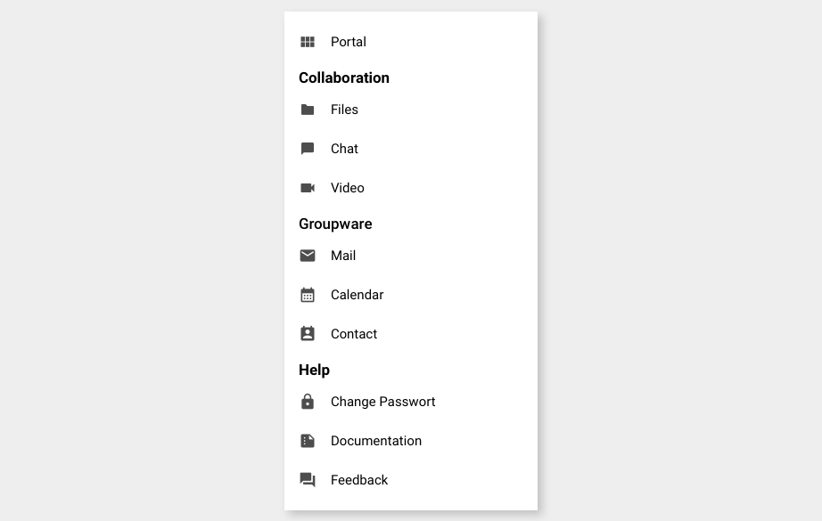
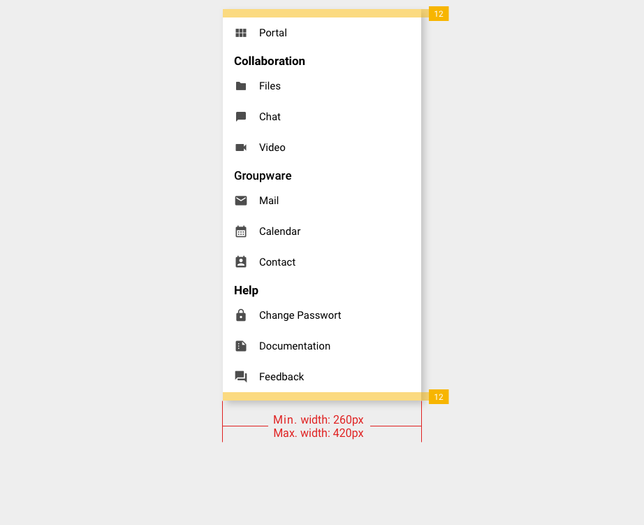
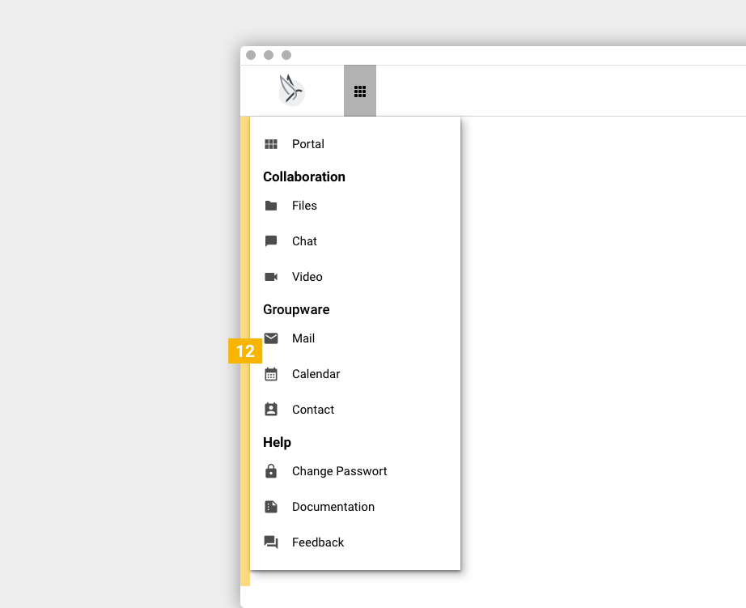

# Central Navigation

|                                   |                                                     |
| --------------------------------- | --------------------------------------------------- |
| Story for original implementation | [PBSR-173](https://jira.open-xchange.com/browse/PBSR-173)
| Code repository                   | <https://gitlab.open-xchange.com/extensions/public-sector>
| Package(s)                        | `open-xchange-appsuite-public-sector`
| Required capabilities             | `com.openexchange.capability.public-sector`, `com.openexchange.capability.public-sector-navigation`
| Available since                   | 7.10.6
| Maintainers                       | Viktor Pracht

## Introduction and Goal

The goal is to easily and seamlessly navigate between the different Phoenix communication and colloaboration aps. In example it should be possible to directly jump from Nextcloud into OX App Suite without using the Univention Portal and vice versa.

To achieve this, a central navigation element is provided that can replace and unify the various navigations of the Phoenix applications.  All applications enabled for the user are offered in this navigation and can be accessed directly.

In addition to a design that matches the look and feel of the Phoenix applications (see Look and Feel), it must be ensured that this element can be integrated as easily as possible by all Phoenix applications. For this purpose, in addition to a style guide, an HTML & CSS template should be provided that can be easily adopted by other applications.

As an example, this central navigation will be implemented for OX App Suite and Nextcloud to check its feasibility. Only then will the navigation be integrated into other Phoenix applications.

## Central Navigation Concept

Central navigation is reserved for the apps within the Phoenix Suite and acts as the main line from which users can see other places to visit at a glance. This area is displayed identically on all apps to provide a consistent way of getting anywhere in the application. This area includes a list of Phoenix Suite apps and introductory items to other areas of the Phoenix Suite. Regardless of which app users are in, the navigation is in the same location, so they can move quickly from one app to the other without stepping backwards.


### Structure

The element consists of a list of apps that are categorized in their areas. Each app is shown as a separate entry in the navigation system

The categories contain general category titles for the apps. Category titles do not serve as links, but are intended to provide the user with a better overview in order to navigate contexts faster within the app.

Note: The Portal entry will be implemented in a later release as this requires some additonal changes in the Univention Portal.



## Specifications

### Spacing and Width



**Important:** The width of the central navigation depends on the content. The width grows with longer text sizes. Given the string of an item is longer than the max width of 420px, then the item is displayed in multi lines.

### Alignment

The central navigation opens right under the top bar and is left aligned with a margin of 12 px to from viewport edge to central navigation edge.



### Group Header


| Element    | Attribute   | Value     |
|------------|-------------|-----------|
| Item title | Color       | `#1f1f1f` |
|            | Font size   | `17px`    |
|            | Font weight | `bold`    |
|            | Line height | `20px`    |


### List Item


| Element    | Attribute   | Value           |
|------------|-------------|-----------------|
| Item icon  | Size        | `20px` x `20px` |
| Iten title | Color       | `#1f1f1f`       |
|            | Font size   | `15px`          |
|            | Font weight | `normal`        |
|            | Line height | `20px`          |


## List of Apps

To achieve a unified appearance, all applications must show an identical navigation menu, which includes the same list of apps. To enable integration of applications from other vendors in the future, the list of apps needs to be maintained centrally. The existing list of portal tiles from the Univention portal is a natural choice for this.

The list is freely configurable and is stored in LDAP. It also allows to assign different subsets of apps to different users based on groups. Due to this complexity, the resolution of the groups and querying LDAP will be implemented by Univention.

A webservice will be available for applications to query the apps visible to a particular user, based on that user's OIDC token.

The list of apps can be split into categories, based on common topics to allow better overview.

## API

A description of all items of the launcher menu is retrieved from a configurable URL in JSON format. The implementation of the Central Navigation in OX App Suite recognizes the following fields:

```json
{
  "categories": [
    {
      "display_name": "Groupware",
      "entries: [
        {
          "display_name": "E-Mail",
          "icon_url": "http://portal.at-univention.de/univention/portal/icons/entries/gw_mail.svg",
          "link": "https://webmail.at-univention.de/appsuite/#app=io.ox/mail",
          "tabname": "tab_groupware"
        }
      ]
    }
  ]
}
```

### Internal Apps

Normally, navigation between apps of the same application will happen internally in the same tab, without real browser navigation or reloading of the current web page (keyword: single-page applications). To implement this, applications will need to recognize and identify their own apps in the list of apps.

Theoretically, this can happen entirely based on the link URL. Practically, this assumes that the domain used to enter an app is the same or at least known to the application. A more robust mechanism uses the tab name to recognize own apps, and then use the link URL only to identify which internal app it is.

## Configuration

The Central Navigation is configured in the file `/opt/open-xchange/etc/settings/public-sector.properties`:

```properties
# Category identifier for OX App Suite
io.ox.public-sector//navigation/oxtabname=tab_groupware

# URL of the InterCom Service.
# Defaults to the same host as the OX App Suite UI.
io.ox.public-sector//ics/url=

# Remove quick launchers
io.ox/core//apps/quickLaunchCount=0
```
