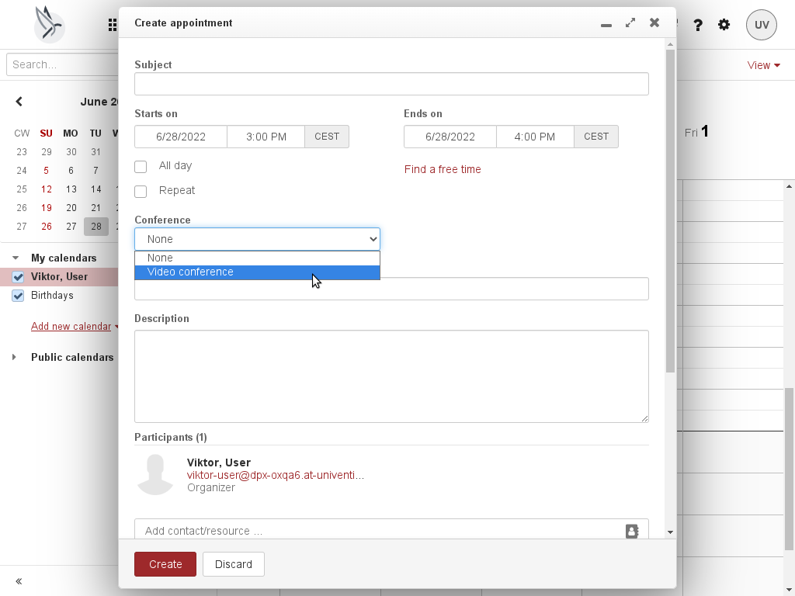
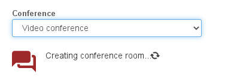
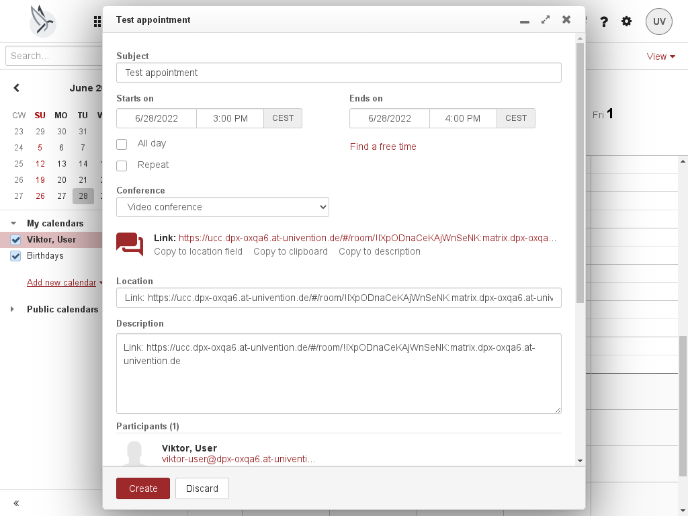

# Support for Video Conference

|                                   |                                                     |
| --------------------------------- | --------------------------------------------------- |
| Story for original implementation | [PBSR-321](https://jira.open-xchange.com/browse/PBSR-321)
| Code repository                   | <https://gitlab.open-xchange.com/extensions/public-sector>
| Package(s)                        | `open-xchange-appsuite-public-sector`
| Required capabilities             | `com.openexchange.capability.public-sector`, `com.openexchange.capability.public-sector-element`
| Available since                   | 7.10.6
| Maintainers                       | Viktor Pracht

## Overview

The integration between OX App Suite and the Element video conference solution is implemented in the calendar module using the existing interfaces for conference solutions. When creating or editing an appointment, the user has the option to add a conference to the appointment.



Selecting the entry "Video conference" immediately creates a chat room in Element.



This is necessary to obtain a link, which the user can copy to the location field, to the clipboard or to the description field.



Following details are copied to the created Element room when it is created and when the appointment dialog is closed:

* Subject
* Description
* Start time
* End time
* Recurrence rule

Not all fields are used by the Element solution at the moment.

If the appointment is deleted, or the appointment creation is canceled, or the conference drop-down is reset to "none", the Element chat room is deleted.

## Configuration

The only configuration besides the required capability is the URL of the Intercom Service, which is used to communicate with the Element server.

```properties
# URL of the InterCom Service.
# Defaults to the same host as the OX App Suite UI.
io.ox.public-sector//ics/url=
```
