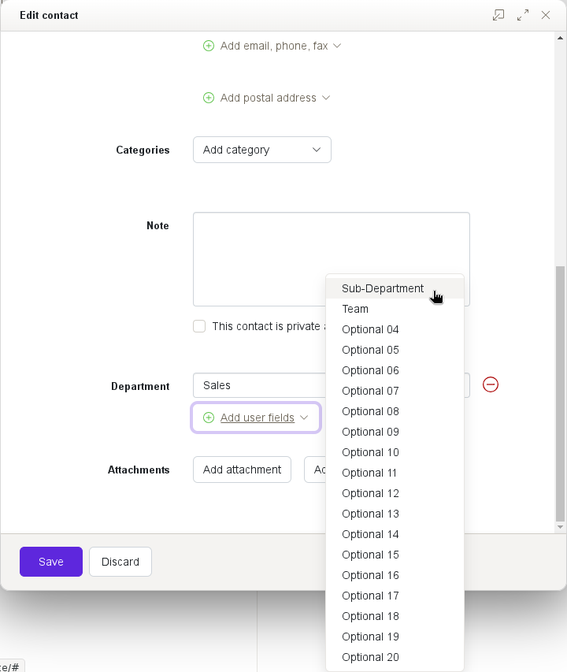
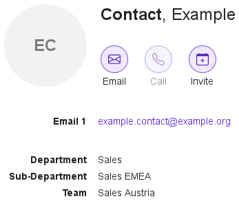

# Contact Labels

|                                   |                                                     |
| --------------------------------- | --------------------------------------------------- |
| Story for original implementation | [PBSRZITSH-46](https://jira.open-xchange.com/browse/PBSRZITSH-46)
| Code repository                   | <https://gitlab.open-xchange.com/extensions/public-sector>
| Package(s)                        | `open-xchange-appsuite-public-sector`
| Required capabilities             | `com.openexchange.capability.public-sector`, `com.openexchange.capability.public-sector-contactlabels`
| Available since                   | 8.21
| Maintainers                       | Viktor Pracht

## Introduction

Contacts in OX App Suite can contain up to 20 custom fields named "Optional 01" through "Optional 20". To get the most use out of these fields, all users sharing contacts need to agree on what each field is supposed to contain. In organizations, this is usually defined centrally. The easiest way for users to remember the definitions is to have descriptive names for the custom fields instead of numbers.

This extension allows an administrator to configure custom labels for any of the 20 optional contact fields. Other fields can be renamed too, but are not officially supported. (Many fields need special handling when displaying or editing.)





## Configuration

The contact labels are configured via the [ConfigCascade](https://documentation.open-xchange.com/main/middleware/miscellaneous/config_cascade.html) as UI settings with the prefix `io.ox.public-sector//contactlabels/` followed by the name of the field `userfield01` through `userfield20`.

Different translations for different languages can be configured by appending the language identifier to the key. When looking up the translation for the current language, first the full full language and variant identifeir like `en_US` is used. If not found, then just the language identifier like `en` is used. And finally, `default` is used as last resort. If none of the three are found, the label is not changed.

Example configuration in `values.yaml`:

```yaml
appsuite:
  core-mw:
    uiSettings:

      # Plain strings
      io.ox.public-sector//contactlabels/userfield01: "Department"
      io.ox.public-sector//contactlabels/userfield03: "Team"

      # Multiple translations
      # British English
      io.ox.public-sector//contactlabels/userfield02/en_GB: "Sub-department"
      # Any other English variant, e.g. en_US
      io.ox.public-sector//contactlabels/userfield02/en: "Subdepartment"
      # German, e.g. de_DE, de_AT
      io.ox.public-sector//contactlabels/userfield02/de: "Unterabteilung"
      # Any other language, e.g. fr_FR
      io.ox.public-sector//contactlabels/userfield02/default: "Sub-Department"
```
