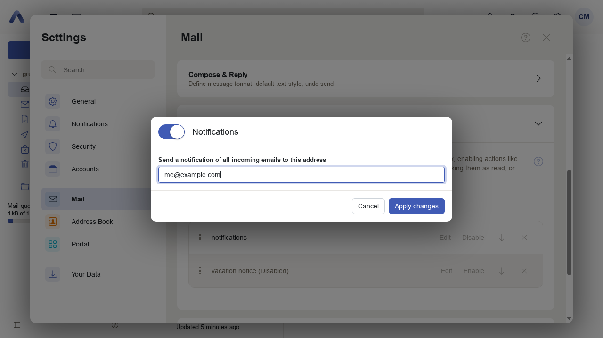
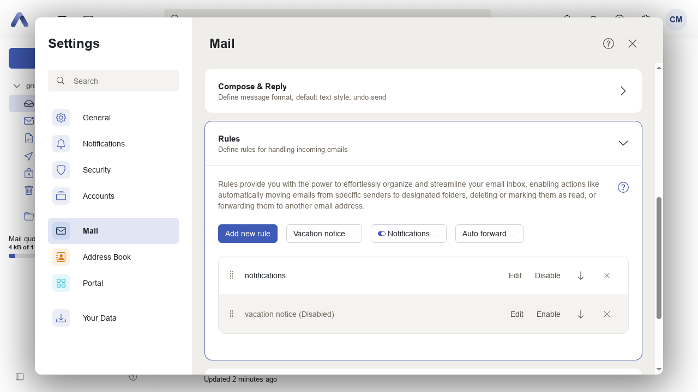
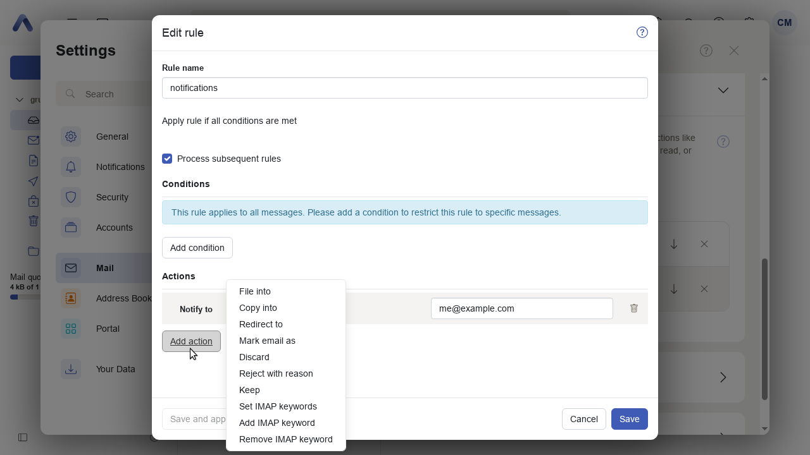

# Nofitication Filter

|                                   |                                                     |
| --------------------------------- | --------------------------------------------------- |
| Story for original implementation | [PBSR-615](https://jira.open-xchange.com/browse/PBSR-615)
| Code repository                   | [extensions/public-sector](https://gitlab.open-xchange.com/extensions/public-sector)
| Package                           | `open-xchange-appsuite-public-sector`
| Required capabilities             | `com.openexchange.capability.public-sector-autonotify`
| Available since                   | 7.10.6-rev0
| Maintainers                       | Viktor Pracht, Simone Leprai

## Overview

This plugin adds an option for a user to create a Sieve filter which uses the 'notify' action to send a short notification to an external email address when a new email arrives in the inbox.
- The notification filter is created in a similar manner to auto-forward, using a popup dialog with a big enable/disable button.
- The created filter appears in the list of filter rules. The edit action opens the same dialog, again similar to auto-forward.
- It is also possible to edit an existing user rule which contains a notify action, but it is not possible to add a new 'notify' action when editing or creating user rules. (The notify action is not present in the action menu.) This is required because users who already have rules with a notify action must be able to edit them, but not create new ones other than the official one.

The feature is enabled using the following capability:

```yaml
appsuite:
  core-mw:
    properties:
      com.openexchange.capability.public-sector-autonotify: "true"
```

The generated Sieve rule will look like follows:

```
# Generated by OX Sieve Bundle on Tue Oct 17 09:29:21 UTC 2023
require [ "vacation" , "enotify" ];

## Flag: autonotify|UniqueId:0|Rulename: notifications
if true
{
notify :message "There are new items in your mailbox" "mailto:user2@example.com?body=There%20are%20new%20items%20in%20your%20mailbox" ;
}
```

Note: The message body has been set in the sieve filter since, if not present, dovecot uses "Notification of new message.", apparently unchangeable.
Note: Subject and body are stored in sieve with the language of the user at the moment of filter creation. Changing the language afterwards does not change already existing filters (unless edited).

## Configuring Mail Contents

The default configuration for subject and message body exist and is currently set to

```json
{
  "subject": {
      "default": "There are new items in your mailbox",
      "de_DE": "Es liegen neue Nachrichten in Ihrem Postfach"
  },
  "body": {
      "default": "There are new items in your mailbox",
      "de_DE": "Es liegen neue Nachrichten in Ihrem Postfach"
  }
}
```

The plugin will try to get a message for the current user locale. If not configured then it will use 'default' one.

It is possible to change messages via configuration like below:

```yaml
appsuite:
  core-mw:
    uiSettings:
      io.ox.public-sector//autonotify/subject/it_IT=Hai nuovi messaggi in Inbox
      io.ox.public-sector//autonotify/body/it_IT=Hai nuovi messaggi in Inbox
      io.ox.public-sector//autonotify/subject/default=There are new items in your mailbox
      io.ox.public-sector//autonotify/body/default='There are new items in your mailbox'
```

## Related Configuration Options

Besides the configuration options introduced by this plugin, several server properties might need to be used to achieve the desired result.

### Disable Auto Forward

The main use case for this plugin is to allow notifications to external accounts without forwarding the entire traffic there. To actually prevent users from forwarding everything, the `redirect` action can be disabled with the following property:

```yaml
appsuite:
  core-mw:
    properties:
      com.openexchange.mail.filter.blacklist.actions: redirect
```

This will also hide the 'Auto forward' button.

Similarly, adding `notify` to that property will disable the support for notifications and hide the 'Notifications' button.

### Disable Apply

The notification rule created by the dialog cannot be applied to existing mails to avoid a flood of notifications. Depending on what kind of user rules with notifications exist, it might also be useful to prevent applying them to existing mails. This can be done with the following property:

```yaml
appsuite:
  core-mw:
    properties:
      com.openexchange.mail.filter.options.apply.blockedActions: redirect,notify
```

Note that the default value for this property is `redirect` to prevent accidentally sending an entire folder's contents somewhere else, and should therefore be kept as part of the value.

## Screenshots






